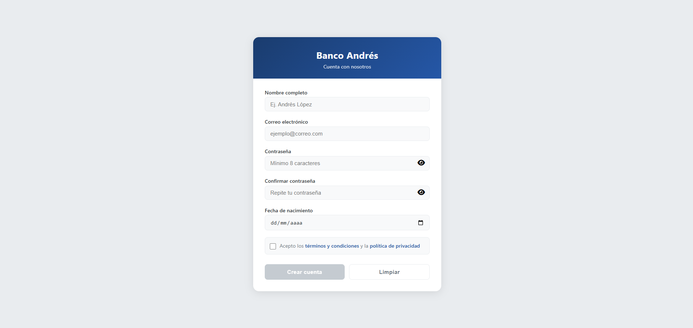
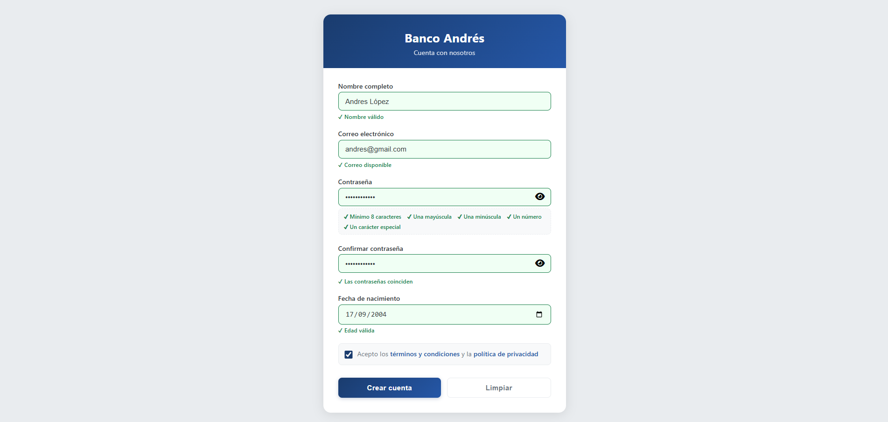
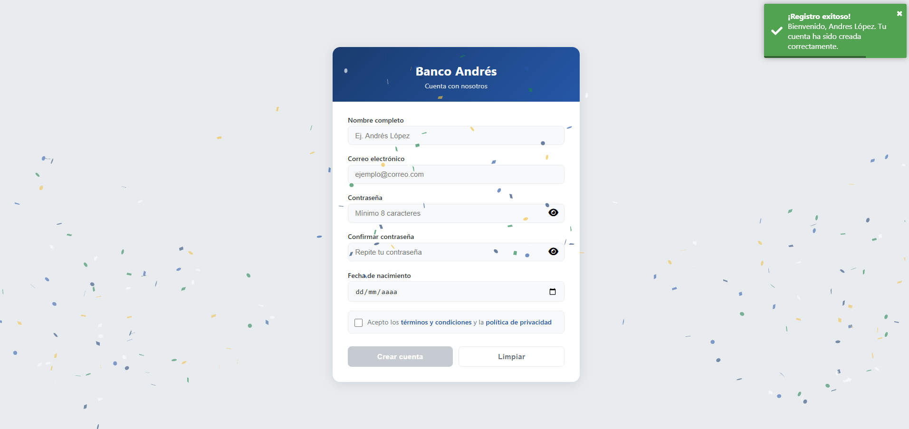
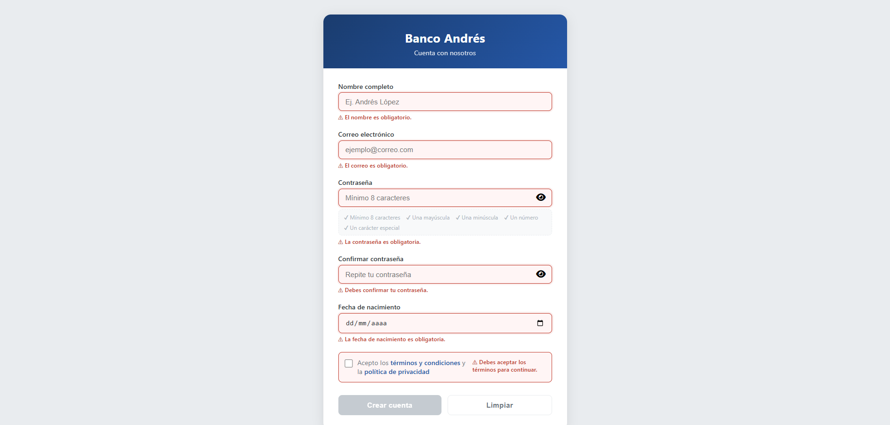

# Banco Andrés — Formulario de Registro

## Screenshots






---

## Web Deployed

- https://banco-andres.netlify.app/

---

## Descripción

Formulario de registro de usuarios para un banco digital. Implementa validación en tiempo real, mensajes de error amigables, confirmación de contraseña, validación de edad mínima y simulación de envío a una API.

---

## Tecnologías utilizadas

| Tecnología      | Versión | Uso                           |
| --------------- | ------- | ----------------------------- |
| Angular         | 19+     | Framework principal           |
| TypeScript      | 5+      | Lenguaje de desarrollo        |
| Reactive Forms  | —       | Manejo del formulario         |
| ngx-toastr      | latest  | Notificaciones de éxito/error |
| canvas-confetti | latest  | Animación de celebración      |
| Font Awesome    | 4.x     | Íconos de UI                  |

---

## Instalación

```bash
# 1. Clonar el repositorio
git clone https://github.com/AndresLopezCorrales/Banco-Andres.git
cd Banco-Andres

# 2. Instalar dependencias
npm install

# 3. Levantar el servidor de desarrollo
ng serve
```

Abre tu navegador en `http://localhost:4200`.

---

## Estructura del proyecto

```
src/
├── app/
│   ├── registro/
│   │   ├── registro.ts          # Lógica del componente
│   │   ├── registro.html        # Template semántico
│   │   └── registro.css         # Estilos del formulario
│   ├── validators/
│   │   └── custom-validators.ts # Validadores personalizados
│   ├── app.ts                   # Componente raíz
│   └── app.config.ts            # Configuración de providers
├── styles.css                   # Estilos globales
└── main.ts                      # Bootstrap de la aplicación
```

---

## Conceptos aplicados

### Reactive Forms

El formulario usa `FormGroup` con `FormBuilder` para agrupar 6 `FormControl`:

```ts
this.registroForm = this.fb.group({
  nombre,
  email,
  password,
  confirmarPassword,
  fechaNacimiento,
  terminos,
});
```

### Validadores personalizados

Implementados en `custom-validators.ts`:

- **`passwordMatch`** — valida que contraseña y confirmación coincidan a nivel de `FormGroup`
- **`minAge(18)`** — calcula la edad real desde la fecha de nacimiento

### Validación asíncrona

El campo `email` simula una consulta a una API con `delay(800)` para verificar si el correo ya está registrado:

```ts
email: ['', [síncronos], [CustomValidators.emailTaken()]];
```

### Mostrar/ocultar errores

Los errores solo se muestran después de que el usuario interactúa con el campo:

```html
*ngIf="campo.invalid && (campo.touched || campo.dirty)"
```

### Botón submit deshabilitado

El botón permanece deshabilitado mientras el formulario sea inválido o esté procesando:

```html
[disabled]="registroForm.invalid || isSubmitting"
```

---

## Campos del formulario

| Campo                  | Validaciones                                                              |
| ---------------------- | ------------------------------------------------------------------------- |
| Nombre completo        | Requerido, mínimo 3 caracteres, máximo 50, solo letras                    |
| Correo electrónico     | Requerido, formato válido, email no registrado (async)                    |
| Contraseña             | Requerido, mínimo 8 caracteres, mayúscula + minúscula + número + especial |
| Confirmar contraseña   | Requerido, debe coincidir con contraseña                                  |
| Fecha de nacimiento    | Requerido, edad mínima 18 años                                            |
| Términos y condiciones | Debe estar marcado                                                        |

---

## Funcionalidades destacadas

- **Indicador de fortaleza** de contraseña en tiempo real
- **Spinner** durante la validación asíncrona del email
- **Mostrar/ocultar** contraseña con botón toggle
- **Toast de éxito** con ngx-toastr al registrarse
- **Confetti** con canvas-confetti al completar el registro
- **Reset inmediato** del formulario tras el envío exitoso (previene doble envío)
- **HTML semántico** con `<main>`, `<section>`, `<header>`, `<footer>`, `aria-*`
- **Diseño responsive** para móviles

---

## Flujo del formulario

```
Usuario llena campos
        ↓
Validación en tiempo real (touched/dirty)
        ↓
Email verifica disponibilidad (async, 800ms)
        ↓
Botón habilitado cuando todo es válido
        ↓
Submit → isSubmitting = true → botón bloqueado
        ↓
setTimeout simula llamada a API (1500ms)
        ↓
Reset inmediato + Toast + Confetti
```

---

## Emails bloqueados (simulados)

Los siguientes correos devuelven error de "ya registrado":

```
admin@banco.com
usuario@banco.com
test@test.com
```

---

## Capturas

> El formulario es completamente responsive y se adapta a pantallas móviles desde 360px.

---

## Autor

**Andrés López Corrales** — Práctica universitaria de Angular  
Materia: Desarrollo Frontend
